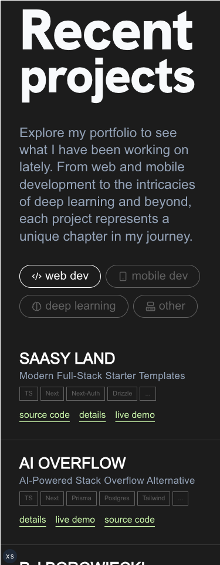

# Personal Portfolio at [pjborowiecki.com](https://pjborowiecki.com)

Personal portfolio website of Piotr Borowiecki - a recent Computer Science graduate from Durham University and an aspiring full-stack software developer. Built with TypeScript, Next.js 14, Sanity.io, Tailwind CSS, GSAP, ShadCN UI, Framer Motion, Locomotive Scroll v.5, and other fantastic tools.

**Work in progress**

## Tools and tech:

- [TypeScript](https://www.typescriptlang.org/)
- [Next.js 14](https://nextjs.org/docs/getting-started)
- [Next-Themes](https://github.com/pacocoursey/next-themes)
- [Tailwind CSS](https://tailwindcss.com/)
- [GSAP](https://gsap.com/)
- [Framer Motion](https://www.framer.com/motion/)
- [Locomotive Scroll](https://scroll.locomotive.ca/docs/#/)
- [Resend](https://resend.com)
- [Zod](https://zod.dev)
